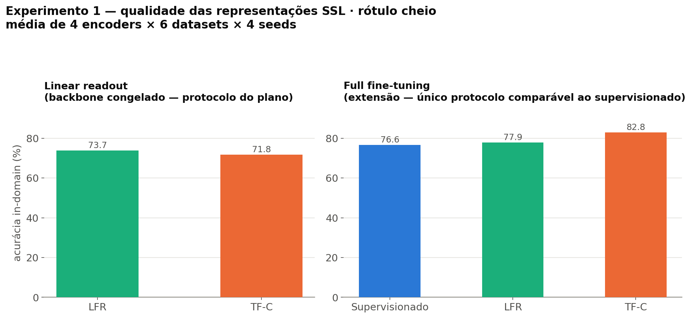
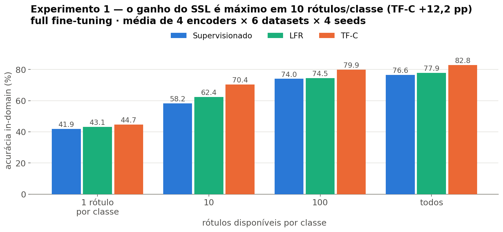
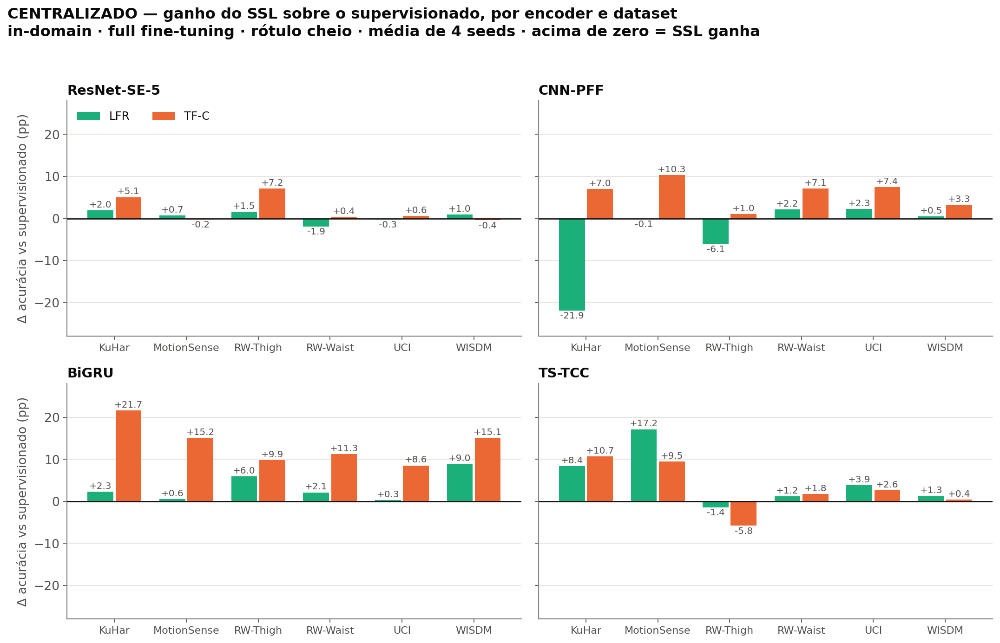
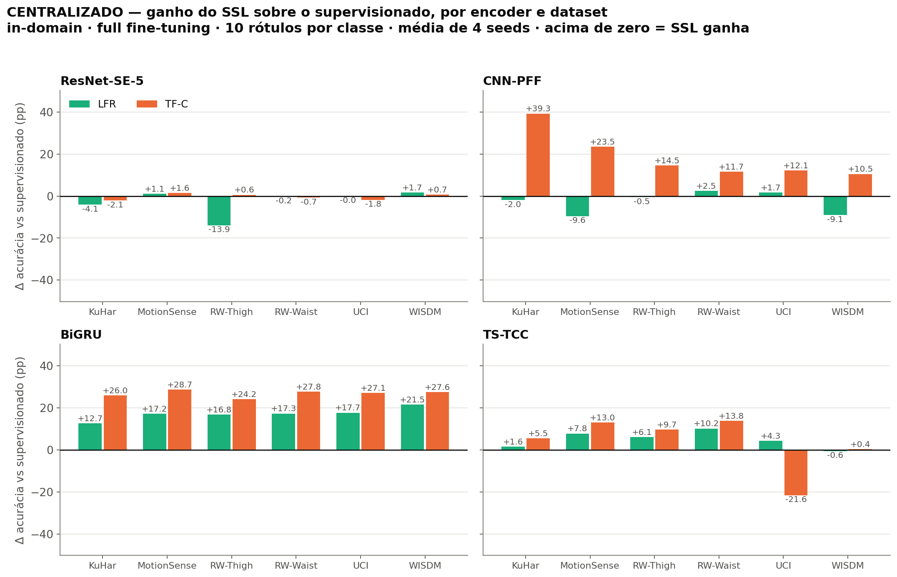
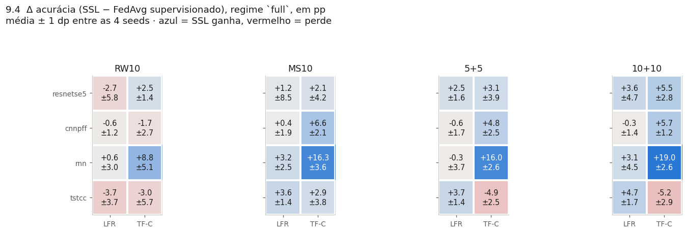
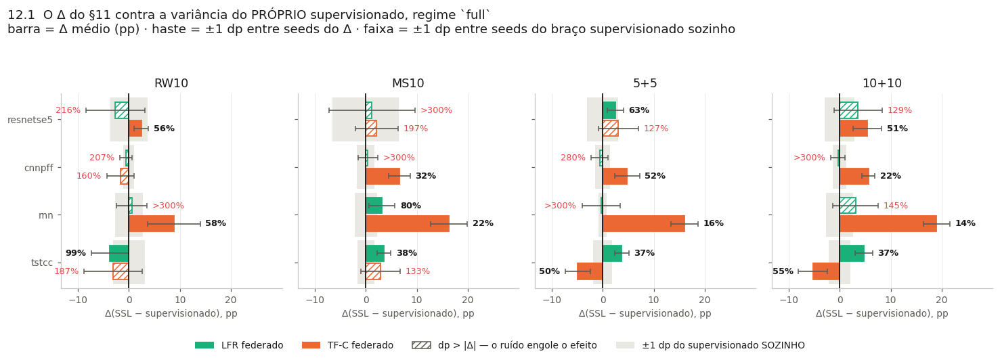
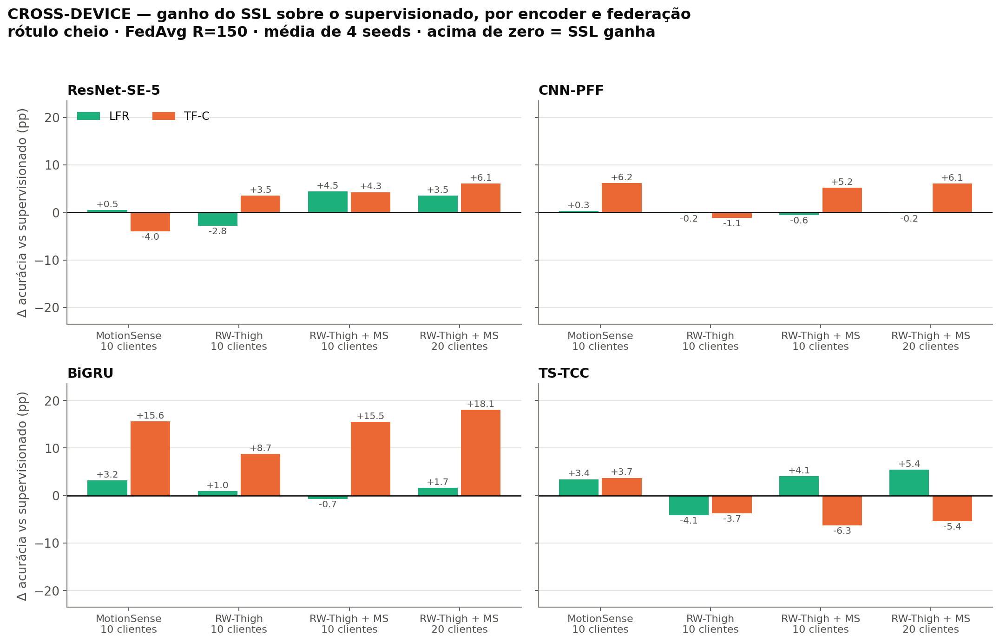
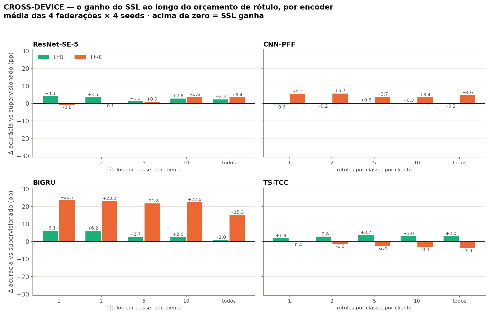
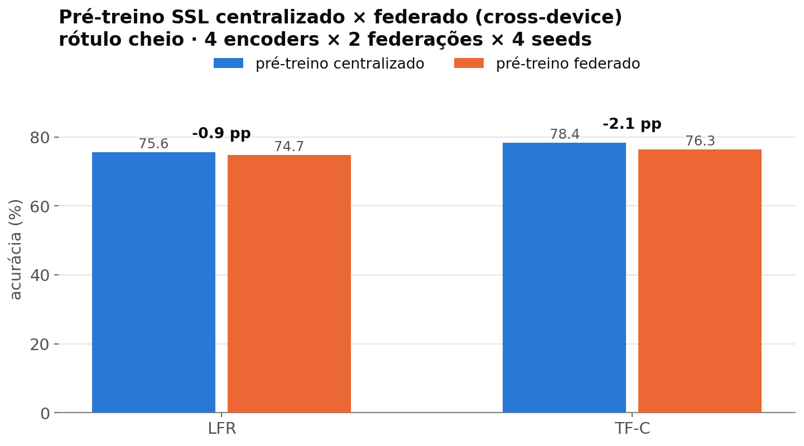

# Plano de Bolsa H.IAAC — o que foi previsto e o que foi entregue

> Material de apoio para a apresentação de **2026-08-24**. Cobre **apenas** os
> resultados do plano original (01/06 a 01/08/2026) com os desenhos antigos.
> **Não** inclui a grade das RQ1/RQ2 iniciada em 23/08, que ainda está rodando.
>
> Escopo desta apresentação: **centralizado** (supervisionado × SSL) e
> **cross-device** (MotionSense + RealWorld_thigh). O eixo cross-silo ficou de fora.
>
> Fontes: `docs/plano_trabalho_inicial_hiaac/` e os caches em `results/`.
> Gráficos em [`resultados_plano_hiaac/`](resultados_plano_hiaac/).

---

## 1. Metodologia

### 1.1 Dados

**DAGHAR** (`standardized_view`), 6 sub-datasets: UCI, MotionSense, KuHar, WISDM,
RealWorld_thigh, RealWorld_waist. Cada amostra é uma janela de IMU de smartphone
em `(6, 60)` — 6 canais (acelerômetro x/y/z + giroscópio x/y/z) × 60 timesteps.
6 classes: sentar, em pé, andar, subir escada, descer escada, correr. Splits
`train`/`validation`/`test` oficiais do benchmark.

### 1.2 Encoders

Quatro arquiteturas, todas do benchmark de referência (da Luz et al., IEEE Access
2026): **ResNet-SE-5**, **CNN-PFF**, **BiGRU** e **TS-TCC Encoder**. O plano
comprometia três; o TS-TCC entrou como extensão.

### 1.3 Técnicas de SSL

**LFR** (*Learning from Randomness*) e **TF-C** (*Time-Frequency Consistency*),
implementadas sobre a biblioteca **Minerva**. Pré-treino sem rótulos; o encoder
resultante inicializa o classificador downstream.

### 1.4 Protocolos de avaliação

| Protocolo | O que treina | Papel |
|---|---|---|
| **Linear readout** | backbone **congelado** + cabeça linear | mede a qualidade da representação; é o protocolo do plano |
| **Full fine-tuning** | tudo | extensão; **é o único comparável ao supervisionado**, que treina o backbone do zero |

> ⚠️ **Não comparar o supervisionado com linear readout** — um treina o backbone,
> o outro o congela. A comparação com o baseline só aparece sob fine-tuning.

### 1.5 Regimes de rótulo

Subamostragem estratificada com semente fixa por seed. No centralizado,
`n_shots ∈ {1, 10, 100, todos}` amostras por classe. No cross-device,
`n_shots ∈ {1, 2, 5, 10, todos}` **por classe e por cliente**.

### 1.6 Métricas e repetições

Acurácia e **F1-macro** no teste; **custo de comunicação** (uplink/downlink em MB
por rodada). **4 seeds** (0–3) em toda a grade; as médias são sobre encoders ×
datasets × seeds.

---

## 2. A federação cross-device — configuração

O plano previa **cross-silo**: 6 clientes, um por dataset. Em **21/07**, por decisão
com o orientador, o eixo migrou para **cross-device**, onde **cada cliente é um
usuário real** — a unidade natural em HAR de smartphone. Um cliente cross-silo
"MotionSense" não existe no mundo; um cliente "usuário 7 do MotionSense" existe.

### 2.1 Parâmetros da federação

| Parâmetro | Valor | Motivo |
|---|---|---|
| **Agregação** | FedAvg ponderado por `n_k` | comprometido no plano |
| **Cliente** | 1 usuário real | unidade natural em HAR de smartphone |
| **Orçamento por cliente** | **192 janelas** | pareado entre braços — mesmo volume por cliente em todas as federações |
| **Épocas locais** | **E = 5** | consenso de 4 papers primários (FedEMA, FedST, Saeed et al.) |
| **Rodadas de fine-tuning** | **R = 150** | escolhido por análise de curva de convergência |
| **Rodadas de pré-treino SSL** | **100** | valor do FedEMA e do FedST |
| **Seeds** | 4 (0–3) | |

### 2.2 As quatro federações

| Tag | Composição | Clientes | O que isola |
|---|---|---|---|
| **MS10** | 10 usuários do MotionSense | 10 | federação in-domain |
| **RW10** | 10 usuários do RealWorld_thigh | 10 | federação in-domain |
| **5+5** | 5 do RW-Thigh + 5 do MotionSense | 10 | **custo do shift a orçamento fixo** — metade do alvo virou domínio estrangeiro |
| **10+10** | 10 do RW-Thigh + 10 do MotionSense | 20 | **valor do dado estrangeiro** — o alvo é constante, o estrangeiro é acrescentado |

Os dois braços mistos são a chave do desenho: **`5+5` troca dado do alvo por dado
estrangeiro** (orçamento constante), **`10+10` acrescenta** (alvo constante).

> ⚠️ **Confundidor a declarar:** `10+10` tem 20 clientes e 3.840 janelas, contra 10
> e 1.920 do `RW10`. Não existe federação com 20 clientes só do alvo, então o
> tamanho da federação e a presença do estrangeiro não estão totalmente separados.

---

## 3. Resultados — centralizado

### 3.1 Qualidade das representações

Rótulo cheio, in-domain, média de 4 encoders × 6 datasets × 4 seeds:

| | Linear readout | Full fine-tuning |
|---|---|---|
| Supervisionado | — *(não comparável)* | **76,6 %** |
| LFR | 73,7 % | 77,9 % |
| TF-C | 71,8 % | **82,8 %** |

**Leitura:** sob fine-tuning, as duas técnicas superam o baseline — TF-C por
**+6,2 pp**, LFR por **+1,3 pp**.

> **Claim calibrado:** *não* dizer "LFR vence TF-C no linear readout". Só vale no
> regime extremo de 1 rótulo/classe; de 10 em diante o TF-C lidera, e no rótulo
> cheio é empate técnico.

### 3.2 Ao longo do orçamento de rótulo

Ganho sobre o supervisionado (fine-tuning):

| Rótulos/classe | 1 | 10 | 100 | todos |
|---|---|---|---|---|
| LFR | +1,2 pp | **+4,2** | +0,5 | +1,3 |
| TF-C | +2,8 pp | **+12,2** | +5,9 | +6,2 |

**Leitura:** o ganho **não** cresce monotonicamente com a escassez — é máximo em
**10 rótulos por classe** e cai no regime extremo de 1. Com 1 rótulo não há sinal
supervisionado suficiente para explorar a representação.

### 3.3 Por encoder e dataset

Δ médio sobre o supervisionado (rótulo cheio, média dos 6 datasets):

| Encoder | LFR | TF-C |
|---|---|---|
| ResNet-SE-5 | +0,5 pp | +2,1 pp |
| CNN-PFF | **−3,9 pp** | +6,0 pp |
| BiGRU | +3,4 pp | **+13,6 pp** |
| TS-TCC | +5,1 pp | +3,2 pp |

- **BiGRU + TF-C é o par dominante** — +13,6 pp, chegando a +21,7 pp no KuHar.
- **LFR prejudica o CNN-PFF** (−3,9 pp), puxado por **−21,9 pp no KuHar**.
- **TS-TCC é o único encoder onde LFR supera TF-C** (+5,1 × +3,2).

> **Sobre o KuHar:** maiores desvios nos dois sentidos. Os autores do DAGHAR
> relataram que o split de validação dele não representa a distribuição global, e
> ele foi **excluído do desenho das RQs** por isso. Ao citar KuHar, mencionar.

---

## 4. Resultados — cross-device

### 4.1 Quem ganha do supervisionado

Δ(SSL − FedAvg supervisionado), rótulo cheio, média ± 1 dp entre as 4 seeds.
Azul = SSL ganha, vermelho = perde.

**Leitura:** o efeito **não é do "SSL"** — é de **pares (técnica × encoder)**.
`BiGRU + TF-C` rende +8,8 a +19,0 pp conforme a federação; `TS-TCC + TF-C`
chega a **−5,2 pp**. Reportar a média entre encoders dilui os dois.

### 4.2 A variância é o problema

A **faixa cinza** é ±1 dp do **braço supervisionado sozinho** — quanto o baseline
oscila de seed para seed, antes de qualquer SSL entrar na conta. Barra hachurada =
o desvio engole o efeito (`dp > |Δ|`).

**Leitura — e é o slide mais honesto do conjunto:** em metade das células o ruído
é maior que o efeito. Mas a faixa cinza mostra que **o ruído não é culpa do SSL nem
da federação**: o próprio supervisionado varia tanto quanto. O diagnóstico é
**número de seeds**, não método — 4 seeds é pouco para separar efeitos de 2–3 pp.

Os pares que sobrevivem ao ruído são justamente os grandes: `BiGRU + TF-C`
(razão dp/Δ de 14–22 %) e `CNN-PFF + TF-C` (22–52 %).

### 4.3 Por encoder e federação

| Encoder | LFR | TF-C |
|---|---|---|
| ResNet-SE-5 | +1,4 pp | +2,5 pp |
| CNN-PFF | −0,1 pp | +4,1 pp |
| BiGRU | +1,3 pp | **+14,5 pp** |
| TS-TCC | +2,2 pp | **−2,9 pp** |

**O padrão do centralizado se mantém no federado**, com uma exceção:
**`TS-TCC + TF-C` inverte de sinal** (+3,2 pp centralizado → −2,9 pp federado).

### 4.4 Ao longo do orçamento de rótulo

| Rótulos/classe por cliente | 1 | 2 | 5 | 10 | todos |
|---|---|---|---|---|---|
| LFR | +2,9 | +3,1 | +2,0 | +2,2 | +1,5 |
| TF-C | **+6,9** | +6,9 | +6,0 | +6,6 | +4,8 |

**Leitura:** no federado o ganho **é maior quando o rótulo é escasso** e decai com
o orçamento — o **oposto** do centralizado, onde o pico é em 10. Faz sentido: cada
cliente tem pouco dado, então a representação pré-treinada pesa mais.
Caso extremo: **BiGRU + TF-C, +23,7 pp com 1 rótulo por classe**.

### 4.5 Pré-treino centralizado × federado

| Técnica | Pré-treino centralizado | Pré-treino federado | Δ |
|---|---|---|---|
| LFR | 75,6 % | 74,7 % | **−0,9 pp** |
| TF-C | 78,4 % | 76,3 % | **−2,1 pp** |

**É o resultado central do plano:** mover o pré-treino SSL para dentro da federação
custa **1 a 2 pp**. O centralizado tem acesso amplo aos dados e funciona como teto;
o federado respeita a privacidade também no pré-treino e paga pouco por isso.

---

## 5. Tabelas-resumo

> **Para o slide:** cada tabela desta seção existe também em
> [`resultados_plano_hiaac/tabelas/`](resultados_plano_hiaac/tabelas/), como
> **PDF compilado em LaTeX** (tectonic, fontes newtx, booktabs) — recortado,
> pronto para arrastar no slide. As tabelas §2.1 e §2.2 também estão lá
> (`tab21_parametros`, `tab22_federacoes`).
>
> O `.tex` de cada uma vem junto: `<nome>.tex` é um ambiente `table` com
> `\caption`/`\label` para `\input{}` num paper, e `<nome>_body.tex` é só o
> `tabular`. Ver o README da pasta.

> **Convenção:** o melhor valor de cada coluna, **dentro de cada bloco**, vai em
> **negrito sublinhado**. Nas tabelas por encoder isso mostra qual técnica vence
> naquele encoder; nas tabelas por técnica, qual encoder vence naquela técnica.

### T1 — Centralizado: acurácia (%) por encoder, dataset e técnica — rótulo cheio, full fine-tuning

| Encoder / técnica | MotionSense | RW-Thigh | RW-Waist | UCI | WISDM | KuHar |
|—|—|—|—|—|—|—|
| **ResNet-SE-5** |   |   |   |   |   |   |
| Supervisionado | 89.5 | 69.7 | 72.9 | 95.4 | 85.5 | 69.1 |
| LFR | **__90.3__** | 71.2 | 71.0 | 95.1 | **__86.4__** | 71.1 |
| TF-C | 89.3 | **__76.9__** | **__73.3__** | **__96.0__** | 85.0 | **__74.2__** |
| **CNN-PFF** |   |   |   |   |   |   |
| Supervisionado | 83.7 | 75.7 | 70.7 | 88.8 | 86.8 | 71.5 |
| LFR | 83.6 | 69.7 | 72.9 | 91.1 | 87.3 | 49.6 |
| TF-C | **__94.0__** | **__76.8__** | **__77.9__** | **__96.2__** | **__90.1__** | **__78.5__** |
| **BiGRU** |   |   |   |   |   |   |
| Supervisionado | 75.9 | 61.6 | 68.6 | 85.2 | 73.6 | 52.7 |
| LFR | 76.5 | 67.6 | 70.7 | 85.4 | 82.6 | 55.1 |
| TF-C | **__91.1__** | **__71.5__** | **__79.9__** | **__93.7__** | **__88.8__** | **__74.4__** |
| **TS-TCC** |   |   |   |   |   |   |
| Supervisionado | 75.7 | **__71.9__** | 72.4 | 90.3 | 86.5 | 64.1 |
| LFR | **__92.9__** | 70.5 | 73.5 | **__94.1__** | **__87.8__** | 72.5 |
| TF-C | 85.2 | 66.2 | **__74.2__** | 92.9 | 87.0 | **__74.8__** |

*Média de 4 seeds. In-domain (fonte = alvo). Melhor técnica de cada coluna, dentro de cada encoder, em negrito sublinhado.*

### T2 — Centralizado: acurácia (%) por técnica, regime de rótulo e encoder

| Técnica / encoder | 1 | 10 | 100 | todos |
|—|—|—|—|—|
| **Supervisionado** |   |   |   |   |
| ResNet-SE-5 | **__55.0__** | **__72.0__** | **__77.9__** | **__80.4__** |
| CNN-PFF | 34.1 | 57.5 | 76.7 | 79.5 |
| BiGRU | 31.6 | 40.9 | 66.0 | 69.6 |
| TS-TCC | 46.8 | 62.5 | 75.4 | 76.8 |
| **LFR** |   |   |   |   |
| ResNet-SE-5 | **__54.6__** | **__69.4__** | **__78.4__** | 80.9 |
| CNN-PFF | 35.2 | 54.7 | 72.5 | 75.7 |
| BiGRU | 41.2 | 58.1 | 69.7 | 73.0 |
| TS-TCC | 41.3 | 67.3 | 77.3 | **__81.9__** |
| **TF-C** |   |   |   |   |
| ResNet-SE-5 | 36.3 | 71.7 | 81.9 | 82.5 |
| CNN-PFF | 47.5 | **__76.1__** | **__83.1__** | **__85.6__** |
| BiGRU | **__47.8__** | 67.8 | 80.4 | 83.2 |
| TS-TCC | 47.3 | 65.9 | 74.1 | 80.0 |

*Rótulos por classe. Média dos 6 datasets $\times$ 4 seeds. Full fine-tuning. Melhor encoder de cada coluna, dentro de cada técnica, em negrito sublinhado.*

### T3 — Cross-device: acurácia (%) por encoder, federação e técnica — rótulo cheio

| Encoder / técnica | MS10 | RW10 | 5+5 | 10+10 |
|—|—|—|—|—|
| **ResNet-SE-5** |   |   |   |   |
| FedAvg supervisionado | 83.1 | 63.4 | 64.2 | 71.0 |
| LFR federado | **__83.6__** | 60.6 | **__68.7__** | 74.5 |
| TF-C federado | 79.1 | **__66.9__** | 68.5 | **__77.1__** |
| **CNN-PFF** |   |   |   |   |
| FedAvg supervisionado | 83.8 | **__69.5__** | 70.9 | 76.5 |
| LFR federado | 84.2 | 69.4 | 70.3 | 76.3 |
| TF-C federado | **__90.0__** | 68.4 | **__76.1__** | **__82.5__** |
| **BiGRU** |   |   |   |   |
| FedAvg supervisionado | 73.6 | 65.1 | 61.4 | 65.2 |
| LFR federado | 76.8 | 66.1 | 60.7 | 66.8 |
| TF-C federado | **__89.2__** | **__73.9__** | **__76.9__** | **__83.3__** |
| **TS-TCC** |   |   |   |   |
| FedAvg supervisionado | 84.5 | **__70.6__** | 73.2 | 74.8 |
| LFR federado | 88.0 | 66.4 | **__77.3__** | **__80.2__** |
| TF-C federado | **__88.3__** | 66.8 | 66.9 | 69.3 |

*Média de 4 seeds, última rodada (R = 150). O regime `todos' do supervisionado vem de fed_cross_device.csv (local_epochs = 5). Melhor técnica de cada coluna, dentro de cada encoder, em negrito sublinhado.*

### T4 — Cross-device: acurácia (%) por técnica, regime de rótulo e encoder

| Técnica / encoder | 1 | 2 | 5 | 10 | todos |
|—|—|—|—|—|—|
| **FedAvg supervisionado** |   |   |   |   |   |
| ResNet-SE-5 | **__68.9__** | **__69.9__** | 70.8 | 69.6 | 70.4 |
| CNN-PFF | 60.5 | 67.2 | **__72.8__** | **__74.8__** | 75.2 |
| BiGRU | 45.2 | 50.9 | 55.9 | 57.5 | 66.3 |
| TS-TCC | 59.2 | 65.1 | 69.9 | 72.3 | **__75.8__** |
| **LFR federado** |   |   |   |   |   |
| ResNet-SE-5 | **__73.3__** | **__73.6__** | 72.2 | 72.9 | 71.8 |
| CNN-PFF | 59.9 | 67.0 | 73.2 | 75.1 | 75.0 |
| BiGRU | 51.2 | 58.1 | 59.6 | 60.8 | 67.6 |
| TS-TCC | 61.2 | 67.8 | **__73.5__** | **__75.4__** | **__78.0__** |
| **TF-C federado** |   |   |   |   |   |
| ResNet-SE-5 | 67.5 | 69.6 | 71.6 | 74.0 | 72.9 |
| CNN-PFF | 65.9 | 73.0 | 76.3 | 78.0 | 79.3 |
| BiGRU | **__68.8__** | **__74.4__** | **__77.3__** | **__79.6__** | **__80.8__** |
| TS-TCC | 58.9 | 64.4 | 68.2 | 70.1 | 72.8 |

*Rótulos por classe POR CLIENTE. Média das 4 federações $\times$ 4 seeds. Melhor encoder de cada coluna, dentro de cada técnica, em negrito sublinhado.*

---

## 6. Resumo para o slide de fechamento

1. **Exp. 1 entregue e superado** — 4 encoders em vez de 3, dois protocolos em vez
   de um, e uma grade de regimes de rótulo que não estava no plano.
2. **TF-C é a técnica mais forte** — +6,2 pp sobre o supervisionado no centralizado
   com rótulo cheio, +12,2 pp com 10 rótulos por classe.
3. **O ganho é concentrado, não distribuído** — `BiGRU + TF-C` rende +13,6 pp no
   centralizado e +14,5 pp no federado (até **+23,7 pp** com 1 rótulo por classe),
   enquanto `TS-TCC + TF-C` **piora** ao federar (−2,9 pp). **Não reportar só a
   média entre encoders.**
4. **No cross-device, quanto menos rótulo, maior o ganho** (+6,9 pp com 1 rótulo
   contra +4,8 no cheio) — o oposto do centralizado.
5. **Federar o pré-treino SSL custa 1–2 pp** — o achado que o plano pedia.
6. **A variância é o gargalo, e não é do método** — o braço supervisionado sozinho
   oscila tanto quanto o Δ. Com 4 seeds não dá para separar efeitos de 2–3 pp;
   o caminho é mais seeds, não outro método.

---

## 7. Ressalvas para ter na ponta da língua

- **O cross-device cobre 2 dos 6 datasets** (MotionSense e RealWorld_thigh). Não
  generalizar para o DAGHAR inteiro.
- **`10+10` confunde tamanho da federação com presença de dado estrangeiro** (§2.2).
- **O regime `full` do cross-device** vem de um join entre dois caches
  (`fed_cross_device` para o supervisionado, `fedssl_cross_device` para o SSL),
  filtrando `local_epochs == 5`. Fecha 192/192 pares, mesmo R=150.
- **KuHar** tem os maiores desvios e foi excluído do desenho das RQs.
- **4 seeds** — metade das células cross-device tem `dp > |Δ|`.

---

## 8. Proveniência

Todos os números saem de caches versionados em `results/`, conferíveis por
`poetry run python scripts/analysis/cache_status.py`. As figuras §4.1 e §4.2 vêm
do notebook `notebooks/fedssl_cross_device_avaliation.ipynb` (§9.4 e §12.1); as
demais foram geradas a partir dos mesmos caches. **Nenhum número desta
apresentação foi treinado para ela.**
